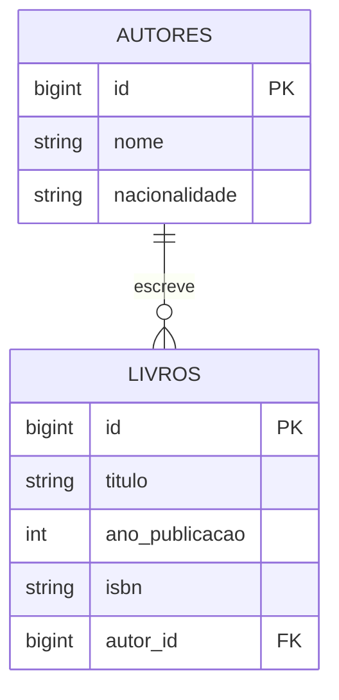

<div align="center" style="text-align: center;">

# Prova Prática LTP3 — CRUD de Biblioteca (Laravel 9 / MVC)


</div>

## Objetivo

Desenvolver um CRUD (Create, Read, Update, Delete) seguindo a arquitetura **MVC** (Model–View–Controller) para uma biblioteca, permitindo cadastrar, listar, editar e excluir **autores** e **livros**. Cada livro pertence a um autor.

A prova é composta por **5 etapas**. Em cada etapa você deve:

1. **Implementar** o que é pedido;
2. **Responder** às questões "Como criar?" e "Como funciona?" no espaço indicado neste README.

> Exemplo de resposta esperada:
> *"A model é criada através do CLI do Laravel executando um comando. Logo a model irá representar a tabela do banco de uma forma abstrata, portanto é importante definir quais são as colunas."*

---

## Sumário

- [0. Preparação do ambiente](#0-preparação-do-ambiente)
- [O que já vem pronto × o que você deve criar](#o-que-já-vem-pronto--o-que-você-deve-criar)
- [Etapa 1 — Models](#etapa-1--models)
- [Etapa 2 — Migrations](#etapa-2--migrations)
- [Etapa 3 — Controllers (com validações)](#etapa-3--controllers-com-validações)
- [Etapa 4 — Rotas](#etapa-4--rotas)
- [Etapa 5 — Formulários de cadastro e edição](#etapa-5--formulários-de-cadastro-e-edição)
- [Checklist de entrega](#checklist-de-entrega)
- [Critérios de avaliação](#critérios-de-avaliação)

---

## 0. Preparação do ambiente

**Pré-requisitos:** PHP 8.2+ (testado com PHP 8.3), Composer e MySQL. Embora o framework aceite PHP 8.0, o `composer.lock` fornecido contém dependências que exigem PHP 8.2 ou superior.

```bash
# 1. Instalar as dependências
composer install

# 2. Criar o arquivo de ambiente
cp .env.example .env        # no Windows (PowerShell): Copy-Item .env.example .env

# 3. Gerar a chave da aplicação
php artisan key:generate
```

4. Crie o banco de dados no MySQL:

```sql
CREATE DATABASE biblioteca CHARACTER SET utf8mb4 COLLATE utf8mb4_unicode_ci;
```

5. Confira as credenciais no `.env`:

```dotenv
DB_CONNECTION=mysql
DB_HOST=127.0.0.1
DB_PORT=3306
DB_DATABASE=biblioteca
DB_USERNAME=root
DB_PASSWORD=
```

6. Crie as tabelas e depois suba o servidor em <http://localhost:8000>:

```bash
php artisan migrate
php artisan serve
```

A página inicial mostra os cards **Autores** e **Livros** com links para os respectivos CRUDs. Cadastre um autor antes de cadastrar um livro.

Para executar os testes: `php artisan test`. Os testes usam SQLite em memória (extensão `pdo_sqlite`), sem alterar o banco MySQL configurado no `.env`.

Validação realizada: 8 testes e 81 assertions aprovados, rotas conferidas com `php artisan route:list --except-vendor` e templates compilados com `php artisan view:cache`. As migrations foram executadas nos testes com SQLite. A execução em MySQL ainda precisa ser conferida com o serviço ativo.

---

## O que já vem pronto × o que você deve criar

### Já vem pronto (não é necessário alterar)

| Arquivo | Descrição |
|---|---|
| `resources/views/layouts/app.blade.php` | Layout base (Tailwind via CDN), menu, mensagens `session('success')` / `session('error')` e `@yield('content')`. |
| `resources/views/welcome.blade.php` | Página inicial. |
| `resources/views/autores/index.blade.php` | Listagem de autores. Espera a variável **`$autores`**. |
| `resources/views/livros/index.blade.php` | Listagem de livros. Espera a variável **`$livros`** (cada livro com o relacionamento **`autor`**). |

As listagens já utilizam os seguintes **nomes de rotas**, portanto suas rotas precisam segui-los:

| Rota | Usada em |
|---|---|
| `autores.index`, `autores.create`, `autores.edit`, `autores.destroy` | Menu e listagem de autores |
| `livros.index`, `livros.create`, `livros.edit`, `livros.destroy` | Menu e listagem de livros |

### Você deve criar

| Etapa | Arquivos |
|---|---|
| 1 | `app/Models/Autor.php`, `app/Models/Livro.php` |
| 2 | `database/migrations/xxxx_create_autores_table.php`, `database/migrations/xxxx_create_livros_table.php` |
| 3 | `app/Http/Controllers/AutorController.php`, `app/Http/Controllers/LivroController.php` |
| 4 | Rotas em `routes/web.php` |
| 5 | `resources/views/autores/create.blade.php`, `resources/views/autores/edit.blade.php`, `resources/views/livros/create.blade.php`, `resources/views/livros/edit.blade.php` |

### Estrutura dos dados

**Autor** (tabela `autores`)

| Coluna | Tipo | Regras |
|---|---|---|
| `id` | bigint (PK) | auto incremento |
| `nome` | string(255) | obrigatório |
| `nacionalidade` | string(100) | obrigatório |
| `created_at` / `updated_at` | timestamp | automático |

**Livro** (tabela `livros`)

| Coluna | Tipo | Regras |
|---|---|---|
| `id` | bigint (PK) | auto incremento |
| `titulo` | string(255) | obrigatório |
| `ano_publicacao` | integer | obrigatório, 4 dígitos |
| `isbn` | string(20) | obrigatório, único |
| `autor_id` | bigint (FK → `autores.id`) | obrigatório, deve existir |
| `created_at` / `updated_at` | timestamp | automático |



---

## Etapa 1 — Models

### Crie as models Autor Livro

### Questões

**Q1.1 — Como criar uma model no Laravel?**

> _Resposta:_
>
>
> Execute `php artisan make:model Autor` e `php artisan make:model Livro`. O Artisan cria as classes em `app/Models`; a opção `-m` também gera uma migration.

**Q1.2 — Como funciona uma model? Explique o papel das propriedades `$table` e `$fillable` e dos relacionamentos `hasMany` / `belongsTo`.**

> _Resposta:_
>
>
> A model representa os registros de uma tabela por meio do Eloquent. `$table` define explicitamente a tabela, necessário para usar `autores` em português. `$fillable` permite atribuição em massa apenas aos campos indicados em `create()` e `update()`. `Autor::livros()` usa `hasMany` porque um autor pode ter vários livros; `Livro::autor()` usa `belongsTo` porque cada livro pertence a um autor por `autor_id`.

---

## Etapa 2 — Migrations

### Crie as migrations para as tabelas 'autores' e 'livros'

Confira no MySQL se as tabelas `autores` e `livros` foram criadas.

> Dica: se precisar refazer, use `php artisan migrate:fresh` (apaga **todas** as tabelas e recria).

### Questões

**Q2.1 — Como criar uma migration e aplicá-la no banco de dados?**

> _Resposta:_
>
>
> Execute `php artisan make:migration create_autores_table` e `php artisan make:migration create_livros_table`. Defina as colunas e configure o banco no `.env`; depois execute `php artisan migrate`. O Laravel registra as migrations aplicadas na tabela `migrations`.

**Q2.2 — Como funciona uma migration? Explique os métodos `up()` e `down()`, a importância da ordem de execução e o que faz `foreignId(...)->constrained(...)`.**

> _Resposta:_
>
>
> A migration versiona a estrutura do banco. `up()` cria ou altera a estrutura; `down()` desfaz a alteração no rollback. Os nomes com timestamps determinam a ordem: autores deve existir antes de livros. `foreignId('autor_id')->constrained('autores')` cria uma coluna de chave estrangeira referenciando `autores.id`. `restrictOnDelete()` impede excluir um autor referenciado; o controller também apresenta uma mensagem amigável.

---

## Etapa 3 — Controllers (com validações)

### Passo a passo

1. Crie os controllers do tipo *resource* já vinculados às models:

   ```bash
   php artisan make:controller AutorController --resource --model=Autor
   php artisan make:controller LivroController --resource --model=Livro
   ```

2. Implemente os métodos em **`AutorController`**:

   | Método | O que deve fazer |
   |---|---|
   | `index()` | Buscar todos os autores e retornar a view `autores.index` com a variável `$autores`. |
   | `create()` | Retornar a view `autores.create`. |
   | `store(Request $request)` | Validar os dados, criar o autor e redirecionar para `autores.index` com mensagem `success`. |
   | `edit(Autor $autor)` | Retornar a view `autores.edit` com a variável `$autor`. |
   | `update(Request $request, Autor $autor)` | Validar os dados, atualizar o autor e redirecionar com mensagem `success`. |
   | `destroy(Autor $autor)` | Excluir o autor e redirecionar com mensagem `success`. |

   > Os métodos `show()` podem ser removidos (não serão usados).

3. Implemente os métodos em **`LivroController`** seguindo o mesmo padrão, com as diferenças:
   - `index()` deve carregar o autor junto: `Livro::with('autor')->get()`;
   - `create()` e `edit()` devem enviar também a lista de autores (`$autores`) para montar o `<select>` do formulário.

4. **Validações** — utilize `$request->validate([...])` diretamente no controller, dentro de `store()` e `update()`:

   **Autor**

   | Campo | Regras |
   |---|---|
   | `nome` | `required`, `string`, `max:255` |
   | `nacionalidade` | `required`, `string`, `max:100` |

   **Livro**

   | Campo | Regras |
   |---|---|
   | `titulo` | `required`, `string`, `max:255` |
   | `ano_publicacao` | `required`, `integer`, `digits:4` |
   | `isbn` | `required`, `string`, `max:20`, `unique:livros,isbn` (no `update`, ignore o próprio registro: `unique:livros,isbn,` . `$livro->id`) |
   | `autor_id` | `required`, `exists:autores,id` |

   Use o array retornado pelo `validate()` para criar/atualizar o registro (ex.: `Autor::create($dados)`).

5. **(Opcional)** No `destroy()` do autor, impeça a exclusão caso ele possua livros, redirecionando com `with('error', '...')`. Sem isso o banco lançará erro de chave estrangeira.

### Questões

**Q3.1 — Como criar um controller? Qual a diferença de usar as opções `--resource` e `--model`?**

> _Resposta:_
>
>
> Execute `php artisan make:controller AutorController --resource --model=Autor` e o equivalente para Livro. `--resource` gera os métodos convencionais do CRUD; `--model` associa o recurso à model e gera parâmetros tipados nos métodos correspondentes.

**Q3.2 — Como funciona um controller dentro da arquitetura MVC? Explique a comunicação entre Model, View e Controller e o que é o *Route Model Binding* (ex.: receber `Autor $autor` no método).**

> _Resposta:_
>
>
> O Controller recebe a requisição encaminhada pela rota, valida os dados, consulta ou altera as Models e retorna uma View ou redirecionamento. A View apresenta os dados e formulários; a Model trata a persistência. No Route Model Binding, o Laravel resolve o identificador da URL em uma instância de `Autor` ou `Livro`, retornando 404 quando o registro não existe. O parâmetro `{autor}` deve corresponder a `Autor $autor`.

**Q3.3 — Como funciona o `$request->validate()`? O que acontece quando a validação falha e quando ela passa?**

> _Resposta:_
>
>
> `$request->validate()` verifica os campos pelas regras informadas. Se falhar em uma requisição web, redireciona para a página anterior com os erros e os dados enviados na sessão; em uma requisição que espera JSON, retorna 422 com os erros. Se passar, retorna somente os dados validados, usados em `create()` ou `update()`. Na edição, a regra de ISBN único ignora o próprio livro para permitir manter seu ISBN.

---

## Etapa 4 — Rotas

### Passo a passo

1. Em `routes/web.php`, importe os controllers:

   ```php
   use App\Http\Controllers\AutorController;
   use App\Http\Controllers\LivroController;
   ```

2. Registre as rotas de recurso:
   - `Route::resource('autores', AutorController::class)->parameters(['autores' => 'autor']);`
     > ⚠️ Sem o `parameters()`, o Laravel geraria o parâmetro `{autore}` (singular em inglês) e o *Route Model Binding* com `Autor $autor` não funcionaria.
   - `Route::resource('livros', LivroController::class);`
   - (Opcional) use `->except(['show'])` em ambas.

3. Liste as rotas criadas e confira os nomes (`autores.index`, `autores.create`, ...):

   ```bash
   php artisan route:list
   ```

4. Acesse <http://localhost:8000/autores> e <http://localhost:8000/livros>. As listagens devem abrir (vazias) e o menu superior deve exibir os links.

### Questões

**Q4.1 — Como criar as rotas de um CRUD no Laravel? Quais rotas o `Route::resource` gera (método HTTP, URI, ação e nome)?**

> _Resposta:_
>
>
> Importe os controllers em `routes/web.php` e registre `Route::resource('autores', AutorController::class)->parameters(['autores' => 'autor'])->except(['show'])` e `Route::resource('livros', LivroController::class)->except(['show'])`. Um resource completo gera: GET `/autores` → index (`autores.index`); GET `/autores/create` → create (`autores.create`); POST `/autores` → store (`autores.store`); GET `/autores/{autor}` → show (`autores.show`); GET `/autores/{autor}/edit` → edit (`autores.edit`); PUT/PATCH `/autores/{autor}` → update (`autores.update`); DELETE `/autores/{autor}` → destroy (`autores.destroy`). Livros segue o mesmo padrão com `{livro}`. Nesta implementação, `show` foi excluída porque não é utilizada.

**Q4.2 — Como funciona o sistema de rotas? Explique o caminho de uma requisição desde a URL até o controller e a utilidade das rotas nomeadas (`route('autores.index')`).**

> _Resposta:_
>
>
> O Laravel combina método HTTP e URI com a rota registrada, executa os middlewares do grupo web, resolve os parâmetros e chama a ação do controller. O controller devolve a resposta. Rotas nomeadas permitem gerar URLs com `route('autores.index')` ou `route('autores.edit', $autor)` sem espalhar endereços fixos pelos templates.

---

## Etapa 5 — Formulários de cadastro e edição

### Passo a passo

Crie as quatro views abaixo. Todas devem estender o layout base com `@extends('layouts.app')` e colocar o conteúdo em `@section('content')`.

1. **`resources/views/autores/create.blade.php`**
   - `<form>` com `method="POST"` e `action="{{ route('autores.store') }}"`;
   - `@csrf`;
   - Campos `nome` e `nacionalidade` com `value="{{ old('nome') }}"`;
   - Exibição de erros de cada campo com `@error('campo') ... @enderror`;
   - Botão salvar e link para voltar à listagem.

2. **`resources/views/autores/edit.blade.php`**
   - Mesmo formulário, com `action="{{ route('autores.update', $autor) }}"`;
   - `@csrf` **e** `@method('PUT')`;
   - Campos preenchidos com `old('nome', $autor->nome)`.

3. **`resources/views/livros/create.blade.php`**
   - Campos `titulo`, `ano_publicacao`, `isbn`;
   - `<select name="autor_id">` percorrendo `$autores` com `@foreach`, mantendo a opção selecionada com `old('autor_id')`.

4. **`resources/views/livros/edit.blade.php`**
   - Mesmo formulário com `@method('PUT')` e valores do `$livro`;
   - No `<select>`, marque como `selected` o autor atual (`old('autor_id', $livro->autor_id)`).

5. Teste o fluxo completo:
   - Cadastrar, editar e excluir um autor;
   - Cadastrar, editar e excluir um livro;
   - Enviar formulários vazios/inválidos e verificar se as mensagens de erro aparecem e os valores digitados são mantidos.

> Dica: o layout usa Tailwind CSS. Você pode seguir o estilo das listagens, por exemplo: `class="w-full rounded border px-3 py-2"` para inputs.

### Questões

**Q5.1 — Como criar um formulário Blade para cadastro e para edição? Por que o formulário de edição precisa de `@method('PUT')` e para que serve o `@csrf`?**

> _Resposta:_
>
>
> Crie arquivos `.blade.php` em `resources/views`, estenda `layouts.app` e defina a seção `content`. Cadastro usa POST para a rota `store`; edição envia POST para `update` com `@method('PUT')`, que gera o campo oculto `_method`, pois formulários HTML não enviam PUT diretamente. `@csrf` gera o token oculto verificado pelo middleware contra falsificação de requisições. A edição preenche os campos com os valores da model e o select com o autor atual.

**Q5.2 — Como funciona a exibição dos erros de validação e a manutenção dos dados digitados? Explique `$errors`, `@error` e `old()`.**

> _Resposta:_
>
>
> `$errors` é a coleção de mensagens disponibilizada às views depois de uma validação malsucedida. `@error('nome')` verifica um erro específico e expõe `$message`. `old('nome')` recupera da sessão o valor enviado anteriormente; `old('nome', $autor->nome)` usa o valor da model como padrão na edição. O select compara `old('autor_id', $livro->autor_id)` com o ID de cada autor para preservar a escolha.

---

## Checklist de entrega

- [x] Models `Autor` e `Livro` com `$fillable` e relacionamentos
- [ ] Migrations de `autores` e `livros` executadas com chave estrangeira
- [x] `AutorController` e `LivroController` com `index`, `create`, `store`, `edit`, `update`, `destroy`
- [x] Validações com `$request->validate()` em `store` e `update`
- [x] Rotas `resource` registradas e nomeadas corretamente
- [x] Views `create` e `edit` de autores e livros
- [x] Mensagens de erro e de sucesso exibidas
- [x] Todas as questões (Q1.1 a Q5.2) respondidas neste README


## Licença

Distribuído sob a licença MIT. Veja [LICENSE](LICENSE).
